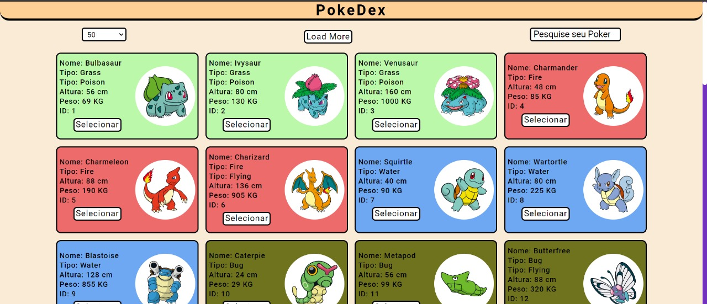
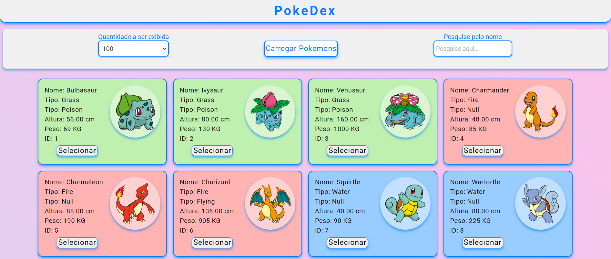

# Aplicação Pokedex

## 💻 Descrição do projeto

A PokeDex é uma aplicação que permite aos usuários visualizar informações sobre diversos Pokémon, incluindo nome, tipo, altura e peso.

O objetivo é proporcionar uma interface interativa e agradável para explorar o mundo dos Pokémon.

> **Colaboração:** Not found  
> **Status:** <span> Concluído  ✔️ 

<div width="200px" display="flex" align="center">
  <p>Primeira Versão do Projeto - 06/2024</p>
  
  <p>Segunda Versão do Projeto - 10/2024</p>
  
  <p>Terceira Versão do Projeto - 02/2025</p>
  
</div>

## 📜 Índice

- [Descrição](#-descrição-do-projeto)
- [Conceitos Aprendidos](#-conceitos-aprendidos)
- [Tecnologias Utilizadas](#--tecnologias-utilizadas)
- [Instalação](#-instalação)
- [Uso](#-uso)
- [Funcionalidades](#-funcionalidades)
- [Pendências](#-pendências)
- [Contribuição](#-contribuição)
- [Informações Adicionais](#-informações-adicionais)
- [Licença](#-licença)
- [Conclusão](#-conclusão)

## ✅ Conceitos Aprendidos 

- Manipulação do DOM usando JavaScript.
- Requisições assíncronas para obter dados da API do Pokémon.
- Utilização de eventos para interatividade com o usuário.
- Implementação de funcionalidades de busca e filtro de dados.
- Estruturação e estilização da aplicação com HTML e CSS.

## 🛠 Tecnologias Utilizadas


## ⚙ Instalação

Para começar a usar este projeto, siga as etapas abaixo no seu terminal:

1. Faça um fork do repositório:
   <pre>git fork https://github.com/IgoRenatoo/JS-API-PokeDexApplication.git</pre>

2. Clone o seu fork para sua máquina:
   <pre>git clone https://github.com/IgoRenatoo/JS-API-PokeDexApplication.git</pre>

3. Acesse o diretório do projeto:
   <pre>cd JS-API-PokeDexApplication </pre>

4. Instale a extensão Live Server:
   <pre> code --install-extension ritwickdey.LiveServer </pre>

## 🚀 Uso 

Para usar o projeto, siga os passos abaixo:

1. Execute o comando ```ALT+L ALT+O``` para abrir o arquivo HTML no seu navegador.

## 🧩 Funcionalidades

1. **Carregar Pokémon (Com Paginação)**
Carrega uma quantidade de Pokémon e exibe na tela com base na seleção do limite (limite por página). O número de Pokémon carregados pode ser ajustado pelo valor da variável `limit`.
   - Quando a página é carregada, o código faz uma requisição à API para obter uma lista de Pokémon com base no `offset` e `limit`. Os Pokémon são carregados em blocos e exibidos na tela. A cada clique no botão "Próximo" ou "Anterior", a lista de Pokémon é atualizada de acordo com a página selecionada.

2. **Exibição de Tipos de Pokémon**
Cada Pokémon é exibido com base nos seus tipos. Cada tipo de Pokémon tem uma cor de fundo específica, facilitando a visualização do seu tipo diretamente na interface.
   - Para cada Pokémon, a classe CSS correspondente ao tipo é adicionada dinamicamente ao elemento que contém o Pokémon. Isso permite uma personalização visual, como a mudança de cor de fundo conforme o tipo do Pokémon (ex.: fire, water, grass, etc.).

3. **Paginação de Pokémon**
A lista de Pokémon é paginada. O usuário pode navegar entre as páginas clicando nos botões "Próximo" e "Anterior". Cada página exibe uma quantidade limitada de Pokémon, determinada pela variável `limit`.
   - A navegação é controlada pelos botões que alteram o valor de `offset`, que controla a página atual. A função `loadNextPage` aumenta o `offset` para carregar a próxima página de Pokémon, e a função `loadPreviousPage` diminui o `offset` para carregar a página anterior.

## ⏳ Pendências

- [ ] Validação de dados no cadastro
- [ ] Adicionar explicação da aplicação em `Suporte`
- [ ] Adicionar atributos aos Pokemons
- [ ] Adicionar opção de selecionar Pokemon em sua conta com limite de 5 pokemons
- [ ] Implementar toda estrutura de `Bag`
- [ ] Ao acessar aba `Conta` exibir lista pokemons do usuário
- [ ] Implementar exclusão de pokemon da lista

## 🤝 Contribuição 

Contribuições são bem-vindas! Se você deseja contribuir com este projeto, siga as etapas abaixo:

1. Faça um fork deste repositório.
2. Clone o seu fork para sua máquina ( `git clone https://github.com/seu_usuário/JS-API-PokeDexApplication ` ).
3. Crie uma branch para sua feature ou correção de bug ( `git checkout -b nome-da-sua-branch` ).
4. Commit suas alterações ( `git commit -m 'Mensagem desejada'` ).
5. Push para a branch ( `git push origin nome-da-sua-branch` ).
6. Abra um Pull Request.
7. Aguarde à análise.

## 💡 Informações adicionais

- A aplicação utiliza a API pública do Pokémon para obter dados.
- Melhorias futuras podem incluir mais informações sobre os Pokémon e integração com outras APIs.

## 🔓 Licença

Este projeto está licenciado sob a Licença MIT.

## 🏁 CONCLUSÃO

O projeto PokeDex foi desenvolvido com o intuito de aprender sobre manipulação de dados e interação com APIs. Durante o desenvolvimento, foram exploradas diversas tecnologias que contribuíram para a criação de uma aplicação dinâmica e interativa.

😄 "Por que os programadores preferem o escuro? Porque eles odeiam bugs!" 🐛
